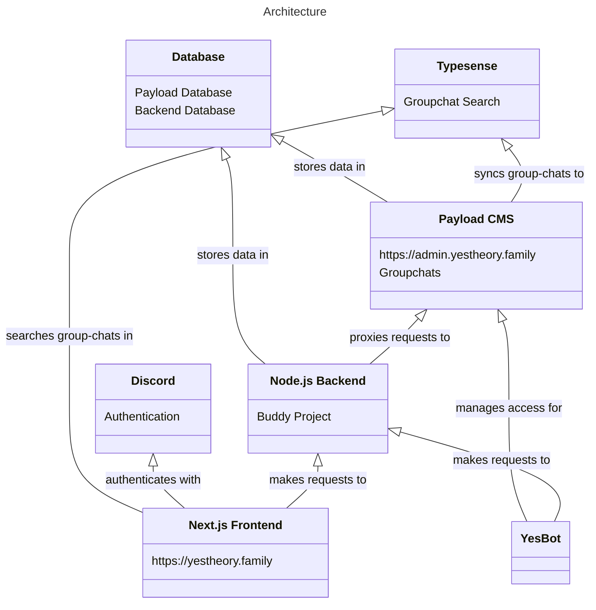

# yestheory.family

This project contains all parts (deducting [YesBot](https://github.com/Yes-Theory-Fam/yesbot-ts)) running
on https://yestheory.family.

The aim of this project is to provide the community of YouTube channel [Yes Theory](https://www.youtube.com/@YesTheory)
with a proper community hub, that shows what this community is capable of in blogs and a photo-gallery and provides both
people new to the community and established members with ways of engaging with other members through features like a
group-chat search and a meetup calendar as well as events like the Buddy Project.

## Contributing

Interested in contributing? Take a look at the [contribution guide](CONTRIBUTING.md)!

## Architecture

There are a lot of moving parts to this, following is a shitty architecture diagram!

The parts of the diagram are explained in further detail below:

### Discord

Discord is used as the authentication provider. This is for several reasons:

1. The main developer is admin of the [Discord community](https://discord.gg/yestheory)
2. The main developer also maintains YesBot which allows tight integration of the two systems
3. Several features make for easy and convenient integrations with Discord

More OAuth providers *might* be integrated in the future but due to the relatively tight integration with Discord, this
may prove to be challenging.

### Database

The [PostgreSQL](https://www.postgresql.org/) database server contains two separate databases, one used by the Payload
CMS, the other used by the custom Node.js backend for storing various data.

### Typesense

[Typesense](https://typesense.org) is a lightweight search engine similar to ElasticSearch and used for performant
search across group-chats (and in the future possibly other entities).

Typesense data is currently managed from the Payload CMS (mirroring CUD-operations) and requested from the frontend
directly with a scoped API-Key.

### Payload CMS

[Payload CMS](https://payloadcms.com) is a CMS that allows for easy CRUD-operations on TypeScript-defined entities. It's
used for managing group-chats and could in the future be extended to things like blogs, newsletters and other entities.

The admin interface of Payload is exposed at https://admin.yestheory.family and uses a custom authentication-scheme that
reuses the credentials from the main frontend. A user's access must be approved by an admin through Discord (a user
without access is prompted for a message which is then sent to an admin to approve or decline that request).

### YesBot

[YesBot](https://github.com/Yes-Theory-Fam/yesbot-ts) (not part of this repository) handles all inputs from Discord.
*Note:* Outputs *to* Discord (e.g. sending messages) may also be done by the Node.js Backend.

### Next.js Frontend

The Next.js frontend does all the rendering and is hosted on https://yestheory.family. It sends GraphQL requests during
the SSR-phase and is largely server rendered.

### Node.js Backend

The Node.js backend primarily acts as a data juggler. It hosts two major GraphQL services, one intended for public
consumption and a second one not exposed to the public web intended for consumption by YesBot. It handles cookie-based
authentication through Discord, acts as entrypoint for YesBot into the rest of the system and exposes specific parts of
Payload's GraphQL schema on both of the services. The pure schema of the YesBot service (which itself is not public) is
publicly exposed for use in YesBot's CI pipelines.

## Directory structure

- `.github` contains the GitHub Actions definitions for this project
- `deployment` contains a [Helm](https://helm.sh/) deployment
- `packages` contains the various parts of the application, more information can be found in each package's `README.md`

## Available scripts

The repository comes with a bunch of yarn scripts you can run to do several things. The most important ones are
available from the root directory of the project and listed here:

`yarn lint` - Fixes all fixable linting issues through Prettier and ESLint  
`yarn eslint:check` - Runs linting in all packages.  
`yarn eslint:write` - Runs linting in all packages and fixes auto-fixable problems.  
`yarn format:check` - Runs prettier on the entire project and reports styling issues.  
`yarn format:write` - Runs prettier on the entire project and fixes styling issues.  

More scripts are available in each package and will be listed in the respective `README.md`.

## `.env` files

This project uses a fair number of `.env` files:

- `.env` contains environment variables used in the [Docker setup](#docker)
- `packages/*/.env` contains the environment variables used for the respective package
  - *for the `web` package, the file is called `.env.local`*

For all used `.env` files listed above, there is a `.env.example` file in this repository that you can copy to `./.env`
and adapt to your needs. Each example file has the available variables documented.

## Docker

The server and web packages have been dockerized, and a docker-compose setup using postgres as database is available.

### Environment variables

The docker-compose setup expects a series of environment variables to be set:

`DATABASE_DB_NAME` - The name of the database to use  
`DATABASE_USER` - The user to use for database login  
`DATABASE_PASSWORD` - The password to use for database login  

## Ports

The project currently uses the following ports:

| Port | Service                 |
|------|-------------------------|
| 3000 | Next.js                 |
| 3001 | Payload CMS             |
| 5000 | Backend (Public facing) |
| 5001 | Backend (YesBot facing) |
| 5002 | Backend (YesBot schema) |
| 5433 | Database                |
| 6006 | Storybook               |
